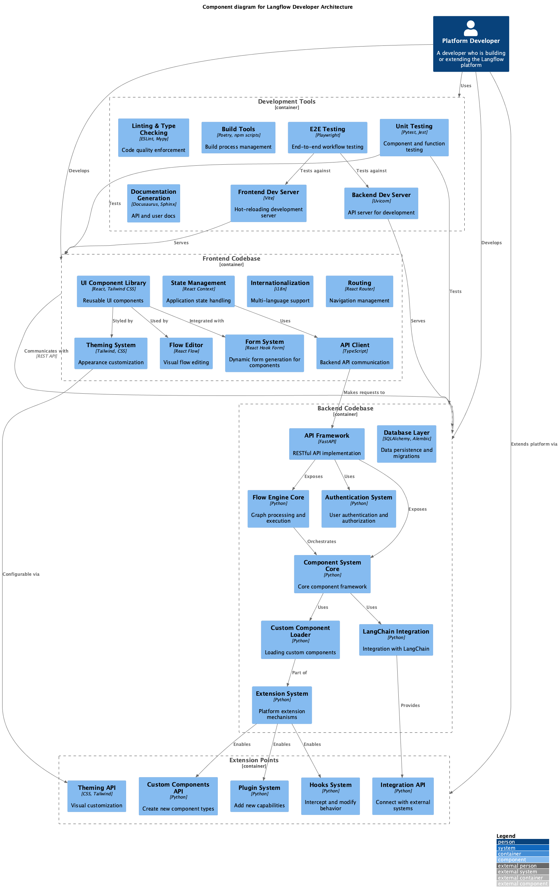
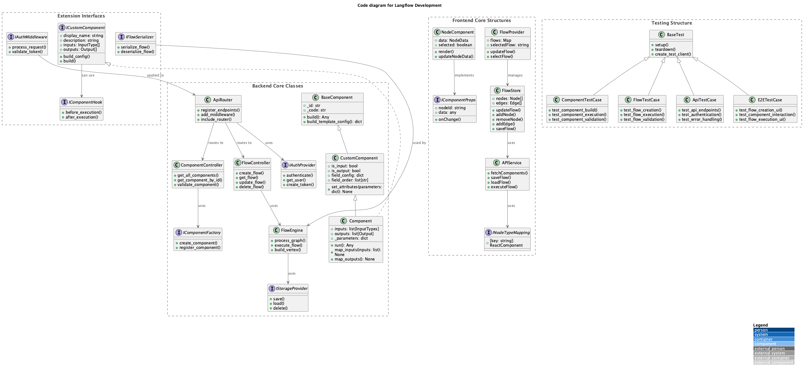
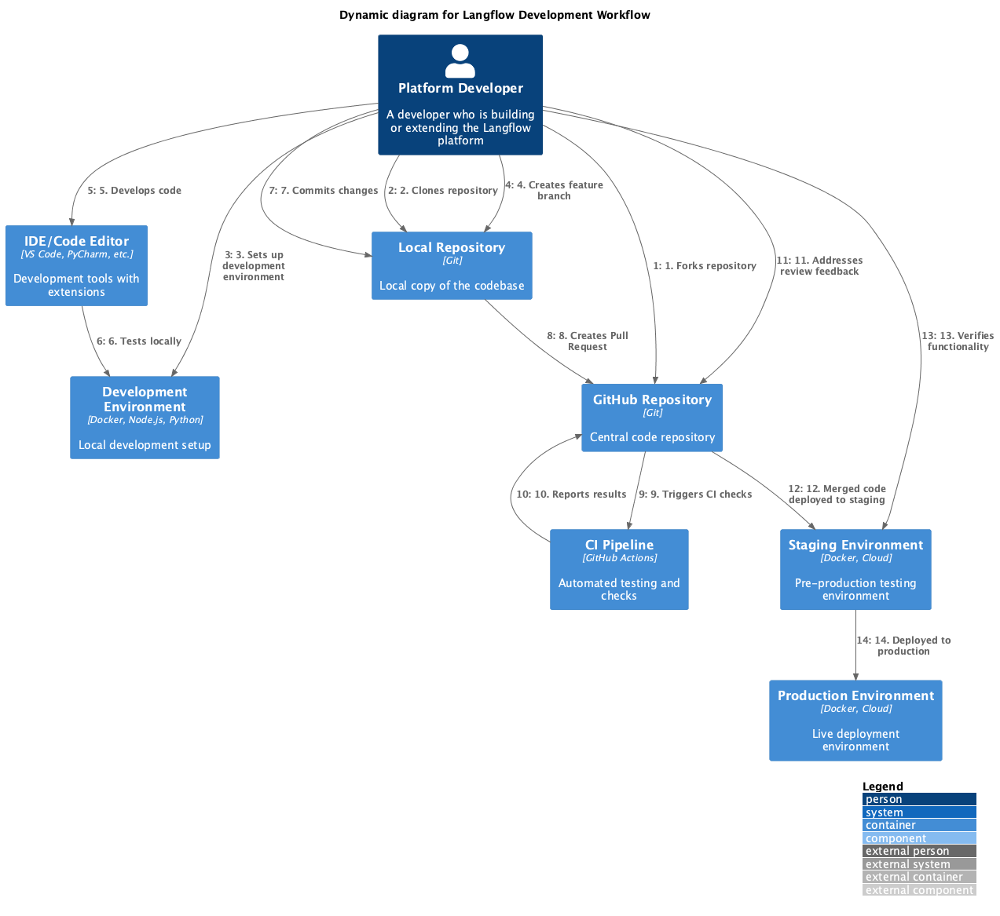

# Langflow Developer Architecture

This document provides an architectural overview of Langflow from a platform developer's perspective. It is intended for developers who are building, maintaining, or extending the Langflow platform itself.

## Overview

The Langflow architecture is designed with extensibility and modularity in mind. The system is structured to allow developers to easily understand, modify, and extend the platform while maintaining compatibility and performance.

## Container Architecture

The container architecture diagram illustrates the high-level organization of the development environment for Langflow:

### Development Environment
- **Frontend Codebase**: React and TypeScript-based UI components with Vite for development
- **Backend Codebase**: Python and FastAPI-based services and core logic
- **Testing Framework**: Comprehensive testing tools for unit, integration, and E2E testing
- **Documentation System**: Tools for generating and maintaining documentation
- **Development Server**: Local environment for development and testing
- **Build System**: Tools for managing dependencies and building artifacts

### CI/CD Pipeline
- **Source Repository**: Git-based version control and collaboration
- **CI System**: Automated testing and quality checks
- **Artifact Registry**: Storage for built artifacts
- **Deployment System**: Automation for deployment processes

### Development Tools
- **LangChain SDK**: Foundation for LLM-based applications
- **Code Quality Tools**: Linters and type checkers for maintaining code standards
- **Package Managers**: Tools for managing dependencies
- **Dev Containers**: Standardized development environments

### Production Environment
- **Production Deployment**: The final deployed system accessible to end users

## Component Architecture

The component architecture diagram details the internal structure of the Langflow codebase:

### Frontend Codebase
- **UI Component Library**: Reusable React components using Tailwind CSS
- **State Management**: Application state handling through React Context
- **API Client**: Communication with the backend API
- **Flow Editor**: Visual flow editor built on React Flow
- **Form System**: Dynamic form generation for components
- **Theming System**: Customizable appearance through Tailwind and CSS
- **Internationalization**: Support for multiple languages
- **Routing**: Navigation management with React Router

### Backend Codebase
- **API Framework**: RESTful API implementation using FastAPI
- **Component System Core**: Framework for defining and managing components
- **Flow Engine Core**: Workflow graph processing and execution
- **LangChain Integration**: Integration with the LangChain framework
- **Authentication System**: User authentication and authorization
- **Database Layer**: Data persistence using SQLAlchemy with Alembic for migrations
- **Custom Component Loader**: System for loading user-defined components
- **Extension System**: Mechanisms for extending the platform

### Development Tools
- **Frontend Dev Server**: Hot-reloading development server using Vite
- **Backend Dev Server**: API server using Uvicorn for development
- **Unit Testing**: Component and function testing using Pytest and Jest
- **E2E Testing**: End-to-end workflow testing with Playwright
- **Linting & Type Checking**: Code quality enforcement using ESLint and Mypy
- **Build Tools**: Build process management with Poetry and npm scripts
- **Documentation Generation**: API and user documentation using Docusaurus and Sphinx

### Extension Points
- **Custom Components API**: API for creating new component types
- **Theming API**: API for visual customization
- **Plugin System**: System for adding new capabilities
- **Integration API**: API for connecting with external systems
- **Hooks System**: System for intercepting and modifying behavior

## Code Architecture

The code architecture diagram provides a detailed view of the class structure and interfaces:

### Backend Core Classes
- **BaseComponent**: Foundational class for all components
- **CustomComponent**: Extension of BaseComponent with additional features
- **Component**: Main implementation class for components
- **ApiRouter**: Handles API routing and middleware
- **FlowController**: Manages flow CRUD operations
- **ComponentController**: Handles component operations
- **FlowEngine**: Processes and executes flows
- **Core Interfaces**: IComponentFactory, IAuthProvider, IStorageProvider

### Frontend Core Structures
- **FlowStore**: Manages flow state and operations
- **APIService**: Handles API communication
- **NodeComponent**: UI representation of flow nodes
- **FlowProvider**: Context provider for flow data
- **Core Interfaces**: IComponentProps, INodeTypeMapping

### Extension Interfaces
- **ICustomComponent**: Interface for creating custom components
- **IFlowSerializer**: Interface for flow serialization
- **IComponentHook**: Interface for component lifecycle hooks
- **IAuthMiddleware**: Interface for authentication middleware

### Testing Structure
- **BaseTest**: Base class for tests
- **ComponentTestCase**: Tests for components
- **FlowTestCase**: Tests for flows
- **ApiTestCase**: Tests for API endpoints
- **E2ETestCase**: End-to-end tests

## Development Workflow

The development workflow diagram illustrates the process for developing and deploying changes to Langflow:

1. **Setup**: Fork repository, clone locally, set up development environment
2. **Development**: Create feature branch, develop code, test locally
3. **Code Review**: Commit changes, create Pull Request, address feedback from CI checks and reviewers
4. **Deployment**: Merged code is deployed to staging, verified, and then deployed to production

## Key Development Principles

When developing for Langflow, keep these principles in mind:

1. **Modularity**: Keep components and services loosely coupled and focused on single responsibilities
2. **Extensibility**: Design for extension through well-defined interfaces and extension points
3. **Type Safety**: Use strong typing in both TypeScript and Python code
4. **Testing**: Write tests for all new features and maintain existing test coverage
5. **Documentation**: Update documentation for any API or behavior changes
6. **Performance**: Consider performance implications, especially for UI responsiveness and flow execution
7. **Accessibility**: Ensure UI components follow accessibility best practices

## Common Development Tasks

### Adding a New Component Type

1. Create a new class inheriting from `Component`
2. Define inputs and outputs
3. Implement required methods
4. Register the component in the appropriate category
5. Add UI representation in the frontend

### Extending the API

1. Create a new router in the API layer
2. Implement endpoint handlers
3. Add authentication and validation
4. Update the API client in the frontend
5. Add tests for the new endpoints

### Creating a Plugin

1. Implement the plugin interface
2. Register the plugin with the extension system
3. Handle plugin lifecycle events
4. Provide appropriate UI integration if needed

## Development Resources

- **GitHub Repository**: [langflow-ai/langflow](https://github.com/langflow-ai/langflow)
- **Documentation**: [Langflow Documentation](https://docs.langflow.org)
- **API Reference**: [API Documentation](https://docs.langflow.org/api)
- **Component Guide**: [Custom Components](https://docs.langflow.org/components-custom-components)